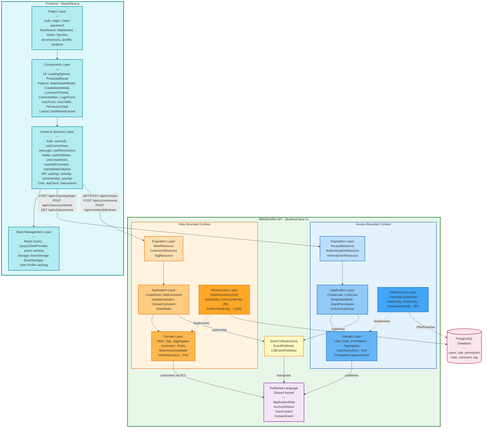

# Diagramme de Composants - Beeboard API

```mermaid
flowchart TB
    subgraph BACKEND["BEEBOARD API - Quarkus/Java 21"]

        subgraph ACCESS_BC["Access Bounded Context"]
            ACC_EXPO["Exposition Layer<br/>AccessResource<br/>AuthenticationResource<br/>InternalUserResource"]
            ACC_APP["Application Layer<br/>CreateUser, LockUser<br/>AssignNewRole, GrantPermission<br/>AuthenticateUser"]
            ACC_DOMAIN["Domain Layer<br/>User, Role, Permission - Aggregates<br/>UserRepository - Port<br/>PrivilegeEscalationGuard"]
            ACC_INFRA["Infrastructure Layer<br/>UserRepositoryImpl<br/>UserEntity, RoleEntity, PermissionEntity - JPA"]

            ACC_EXPO --> ACC_APP
            ACC_APP --> ACC_DOMAIN
            ACC_INFRA -.->|implements| ACC_DOMAIN
        end

        subgraph NOTE_BC["Note Bounded Context"]
            NOTE_EXPO["Exposition Layer<br/>NoteResource<br/>CommentResource<br/>TagResource"]
            NOTE_APP["Application Layer<br/>CreateNote, AddComment<br/>ValidateSolution, CensorComment<br/>ShareNote"]
            NOTE_DOMAIN["Domain Layer<br/>Note, Tag - Aggregates<br/>Comment - Entity<br/>NoteAccessValidator<br/>NoteRepository - Port"]
            NOTE_INFRA["Infrastructure Layer<br/>NoteRepositoryImpl<br/>NoteEntity, CommentEntity - JPA<br/>AuthorViewEntity - CQRS"]

            NOTE_EXPO --> NOTE_APP
            NOTE_APP --> NOTE_DOMAIN
            NOTE_INFRA -.->|implements| NOTE_DOMAIN
        end

        SHARED["Published Language<br/>Shared Kernel<br/>---<br/>ApplicationRole<br/>AccountStatus<br/>UserContext<br/>DomainEvent"]

        EVENT_PUB["Event Infrastructure<br/>EventPublisher<br/>CdiEventPublisher"]
    end

    POSTGRES[("PostgreSQL<br/>Database<br/>---<br/>users, role, permission<br/>note, comment, tag")]

    subgraph FRONTEND["Frontend - React/Next.js"]
        FE_PAGES["Pages Layer<br/>---<br/>Auth: /login, /reset-password<br/>Dashboard: /dashboard, /notes, /access,<br/>/access/users, /profile, /projects"]

        FE_COMPONENTS["Components Layer<br/>---<br/>UI: LoadingSpinner, ProtectedRoute<br/>Feature: NoteDetailsModal, CreateNoteModal,<br/>CommentThread, CommentItem, LoginForm,<br/>UserForm, UserTable, PermissionGate<br/>Layout: DashboardLayout"]

        FE_HOOKS["Hooks & Services Layer<br/>---<br/>Auth: useAuth, useCurrentUser,<br/>useLogin, usePermissions<br/>Notes: useGetNotes, useCreateNote,<br/>useAddComment, useValidateSolution<br/>API: authApi, noteApi, commentApi, userApi<br/>Core: apiClient, interceptors"]

        FE_STATE["State Management Layer<br/>---<br/>React Query: QueryClientProvider,<br/>query caching<br/>Storage: tokenStorage (localStorage),<br/>User Profile caching"]

        %% Internal Frontend Relations
        FE_PAGES --> FE_COMPONENTS
        FE_COMPONENTS --> FE_HOOKS
        FE_HOOKS --> FE_STATE
    end

    %% Relations inter-BC
    ACC_APP -->|publishes| EVENT_PUB
    NOTE_APP -->|subscribes| EVENT_PUB
    ACC_DOMAIN -->|publishes| SHARED
    NOTE_DOMAIN -->|consumes via ACL| SHARED
    EVENT_PUB -->|transports| SHARED

    %% Relations DB
    ACC_INFRA -->|JPA/Panache| POSTGRES
    NOTE_INFRA -->|JPA/Panache| POSTGRES

    %% Relations Frontend-to-Backend
    FE_HOOKS -->|"POST /api/v1/access/login<br/>POST /api/v1/access/refresh<br/>GET /api/v1/access/me"| ACC_EXPO
    FE_HOOKS -->|"GET/POST /api/v1/notes<br/>POST /api/v1/comments<br/>POST /api/v1/notes/{id}/share"| NOTE_EXPO

    %% Styles
    style BACKEND fill:#e8f5e9,stroke:#2e7d32,stroke-width:3px
    style ACCESS_BC fill:#e3f2fd,stroke:#1565c0,stroke-width:2px
    style NOTE_BC fill:#fff3e0,stroke:#ef6c00,stroke-width:2px
    style SHARED fill:#f3e5f5,stroke:#7b1fa2,stroke-width:2px
    style EVENT_PUB fill:#fff9c4,stroke:#f57f17,stroke-width:2px
    style POSTGRES fill:#fce4ec,stroke:#c2185b,stroke-width:2px
    style FRONTEND fill:#e0f7fa,stroke:#00838f,stroke-width:3px

    style ACC_EXPO fill:#bbdefb,stroke:#1565c0,stroke-width:2px
    style ACC_APP fill:#90caf9,stroke:#1565c0,stroke-width:2px
    style ACC_DOMAIN fill:#64b5f6,stroke:#1565c0,stroke-width:2px
    style ACC_INFRA fill:#42a5f5,stroke:#1565c0,stroke-width:2px

    style NOTE_EXPO fill:#ffe0b2,stroke:#ef6c00,stroke-width:2px
    style NOTE_APP fill:#ffcc80,stroke:#ef6c00,stroke-width:2px
    style NOTE_DOMAIN fill:#ffb74d,stroke:#ef6c00,stroke-width:2px
    style NOTE_INFRA fill:#ffa726,stroke:#ef6c00,stroke-width:2px

    style FE_PAGES fill:#b2ebf2,stroke:#00838f,stroke-width:2px
    style FE_COMPONENTS fill:#b2ebf2,stroke:#00838f,stroke-width:2px
    style FE_HOOKS fill:#b2ebf2,stroke:#00838f,stroke-width:2px
    style FE_STATE fill:#b2ebf2,stroke:#00838f,stroke-width:2px
```