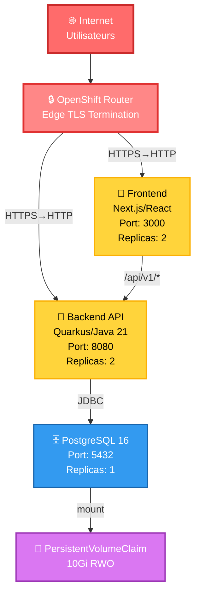

# Diagramme de Déploiement - BeeBoard sur OpenShift

## Vue d'architecture simplifiée

```mermaid
graph TB
    Internet[🌐 Internet<br/>Utilisateurs] --> Router

    Router[🔒 OpenShift Router<br/>Edge TLS Termination]

    Router -->|HTTPS→HTTP| Frontend
    Router -->|HTTPS→HTTP| Backend

    Frontend[🎨 Frontend<br/>Next.js/React<br/>Port: 3000<br/>Replicas: 2]

    Backend[🚀 Backend API<br/>Quarkus/Java 21<br/>Port: 8080<br/>Replicas: 2]

    Database[🗄️ PostgreSQL 16<br/>Port: 5432<br/>Replicas: 1]

    Storage[💾 PersistentVolumeClaim<br/>10Gi RWO]

    Frontend -->|/api/v1/*| Backend
    Backend -->|JDBC| Database
    Database -->|mount| Storage

    classDef network fill:#ff6b6b,stroke:#c92a2a,stroke-width:3px,color:#fff
    classDef router fill:#ff8787,stroke:#e03131,stroke-width:3px,color:#fff
    classDef app fill:#ffd43b,stroke:#fab005,stroke-width:2px,color:#000
    classDef database fill:#339af0,stroke:#1864ab,stroke-width:2px,color:#fff
    classDef storage fill:#da77f2,stroke:#9c36b5,stroke-width:2px,color:#fff

    class Internet network
    class Router router
    class Frontend,Backend app
    class Database database
    class Storage storage
```

## Architecture détaillée

```mermaid
graph TB
    %% ========================
    %% External Layer
    %% ========================
    subgraph Internet["🌐 Internet / Utilisateurs"]
        Users["👥 Utilisateurs<br/>Navigateurs Web"]
    end

    %% ========================
    %% OpenShift Router
    %% ========================
    subgraph Router["🔒 OpenShift Router (Edge TLS Termination)"]
        EdgeTLS["Edge TLS Termination<br/>HTTPS → HTTP<br/>Auto-generated certificates"]
    end

    %% ========================
    %% Namespace beeboard
    %% ========================
    subgraph Namespace["📦 Namespace: beeboard"]

        %% Configuration Layer
        subgraph ConfigLayer["⚙️ Configuration & Secrets"]
            ConfigMapFront["ConfigMap<br/>beeboard-frontend-config<br/>────────────────────<br/>NEXT_PUBLIC_API_URL<br/>API_URL_INTERNAL<br/>LOG_LEVEL"]
            ConfigMapBack["ConfigMap<br/>beeboard-api-config<br/>────────────────────<br/>HTTP_PORT=8080<br/>DB_HOST=postgresql<br/>DB_PORT=5432<br/>DB_NAME=beeboard<br/>CORS_ORIGINS<br/>JWT_ISSUER<br/>SMTP_CONFIG<br/>LOG_LEVEL"]
            SecretBack["Secret<br/>beeboard-api-secrets<br/>────────────────────<br/>DB_USERNAME<br/>DB_PASSWORD<br/>JWT_PRIVATE_KEY (RSA 2048)<br/>JWT_PUBLIC_KEY<br/>RESEND_API_KEY"]
        end

        %% Frontend Layer
        subgraph FrontendLayer["🎨 Frontend Layer"]
            RouteFront["Route<br/>beeboard-frontend<br/>────────────────────<br/>Type: Edge TLS<br/>Auto hostname<br/>HTTP → HTTPS redirect"]
            ServiceFront["Service<br/>beeboard-frontend<br/>────────────────────<br/>Type: ClusterIP<br/>Port: 3000 → 3000<br/>Selector: app=beeboard-frontend"]
            PodFront["Pod: beeboard-frontend<br/>════════════════════<br/>Init Container:<br/>  wait-for-api<br/>  └─ nc -z beeboard-api:8080<br/>────────────────────<br/>Container: beeboard-frontend:latest<br/>  • Next.js 14+ / React 18+<br/>  • User: 1001 (non-root)<br/>  • Port: 3000<br/>  • Health Probes:<br/>    ├─ startupProbe: GET /<br/>    ├─ livenessProbe: GET /<br/>    └─ readinessProbe: GET /<br/>  • Resources:<br/>    ├─ Request: 200m CPU, 256Mi RAM<br/>    └─ Limit: 1 CPU, 1Gi RAM<br/>  • Replicas: 2 (HA)"]
        end

        %% Backend Layer
        subgraph BackendLayer["🚀 Backend API Layer"]
            RouteBack["Route<br/>beeboard-api<br/>────────────────────<br/>Type: Edge TLS<br/>Auto hostname<br/>HTTP → HTTPS redirect"]
            ServiceBack["Service<br/>beeboard-api<br/>────────────────────<br/>Type: ClusterIP<br/>Port: 8080 → 8080<br/>Selector: app=beeboard-api<br/>DNS: beeboard-api.beeboard.svc.cluster.local"]
            PodBack["Pod: beeboard-api<br/>════════════════════<br/>Init Container:<br/>  wait-for-db<br/>  └─ nc -z postgresql:5432<br/>────────────────────<br/>Container: beeboard-api:latest<br/>  • Java 21 / Quarkus (Native)<br/>  • User: 185 (non-root)<br/>  • Port: 8080<br/>  • Health Probes:<br/>    ├─ startupProbe: /q/health/started<br/>    ├─ livenessProbe: /q/health/live<br/>    └─ readinessProbe: /q/health/ready<br/>  • Resources:<br/>    ├─ Request: 500m CPU, 512Mi RAM<br/>    └─ Limit: 2 CPU, 2Gi RAM<br/>  • Replicas: 2"]
        end

        %% Database Layer
        subgraph DatabaseLayer["🗄️ Database Layer"]
            ServiceDB["Service<br/>postgresql<br/>────────────────────<br/>Type: ClusterIP<br/>Port: 5432 → 5432<br/>Selector: app=postgresql<br/>DNS: postgresql.beeboard.svc.cluster.local"]
            PodDB["Pod: postgresql<br/>════════════════════<br/>Container: postgresql-16<br/>  • Image: rhel9/postgresql-16:latest<br/>  • User: 26 (non-root)<br/>  • Port: 5432<br/>  • Health Probes:<br/>    ├─ livenessProbe: TCP:5432<br/>    └─ readinessProbe: pg_isready<br/>  • Resources:<br/>    ├─ Request: 250m CPU, 512Mi RAM<br/>    └─ Limit: 1 CPU, 2Gi RAM<br/>  • Replicas: 1 (RWO limit)<br/>  • Strategy: Recreate"]
        end

        %% Storage Layer
        subgraph StorageLayer["💾 Storage"]
            PVC["PersistentVolumeClaim<br/>postgresql-pvc<br/>────────────────────<br/>Size: 10Gi<br/>Access Mode: ReadWriteOnce (RWO)<br/>Mount: /var/lib/pgsql/data"]
            PV["PersistentVolume<br/>────────────────────<br/>Dynamically provisioned<br/>by OpenShift"]
        end

        %% Bounded Contexts (Internal Architecture)
        subgraph BoundedContexts["🏛️ Bounded Contexts (Backend Internal)"]
            AccessBC["Access BC<br/>────────────────────<br/>• Users (Aggregate Root)<br/>• Roles<br/>• Authentication (JWT)<br/>• Authorization (RBAC)<br/>• User lifecycle"]
            EventBus["CDI Event Bus<br/>────────────────────<br/>In-Memory Events:<br/>• UserCreatedEvent<br/>• UserUpdatedEvent<br/>• RoleAssignedEvent<br/>• UserLockedEvent<br/>• UserUnlockedEvent<br/>• ContractTerminatedEvent"]
            AuthorView["Author View (CQRS)<br/>────────────────────<br/>Materialized View:<br/>• author_id (FK → users.id)<br/>• full_name<br/>• email<br/>• account_status<br/>• Updated by event handlers"]
            NoteBC["Note BC<br/>────────────────────<br/>• Notes (Aggregate Root)<br/>• Comments (Entity)<br/>• Tags<br/>• Visibility rules<br/>• Recipients<br/>• Access validation"]
        end
    end

    %% ========================
    %% Connections
    %% ========================

    %% External to Router
    Users -->|"HTTPS<br/>(TLS 1.2+)"| EdgeTLS

    %% Router to Routes
    EdgeTLS -->|"HTTP<br/>(frontend requests)"| RouteFront
    EdgeTLS -->|"HTTP<br/>(API requests)"| RouteBack

    %% Routes to Services
    RouteFront -->|"route to"| ServiceFront
    RouteBack -->|"route to"| ServiceBack

    %% Services to Pods
    ServiceFront -->|"ClusterIP:3000"| PodFront
    ServiceBack -->|"ClusterIP:8080"| PodBack
    ServiceDB -->|"ClusterIP:5432"| PodDB

    %% Inter-Pod Communication
    PodFront -->|"HTTP GET/POST<br/>/api/v1/*<br/>(SSR + Client-side)"| ServiceBack
    PodBack -->|"JDBC<br/>postgresql://postgresql:5432/beeboard"| ServiceDB

    %% Storage
    PodDB -->|"mount"| PVC
    PVC -->|"claims"| PV

    %% Configuration
    ConfigMapFront -.->|"env vars"| PodFront
    ConfigMapBack -.->|"env vars"| PodBack
    SecretBack -.->|"env vars<br/>(DB credentials)"| PodDB
    SecretBack -.->|"env vars<br/>(JWT, RESEND)"| PodBack

    %% Bounded Contexts Communication
    AccessBC -->|"publishes"| EventBus
    EventBus -->|"updates"| AuthorView
    AuthorView -->|"read by"| NoteBC
    NoteBC -.->|"validates access"| AccessBC

    %% ========================
    %% Styling
    %% ========================
    classDef network fill:#ff6b6b,stroke:#c92a2a,stroke-width:3px,color:#fff
    classDef config fill:#20c997,stroke:#087f5b,stroke-width:2px,color:#000
    classDef service fill:#339af0,stroke:#1864ab,stroke-width:2px,color:#fff
    classDef pod fill:#ffd43b,stroke:#fab005,stroke-width:2px,color:#000
    classDef storage fill:#da77f2,stroke:#9c36b5,stroke-width:2px,color:#fff
    classDef bc fill:#74c0fc,stroke:#1971c2,stroke-width:2px,color:#000
    classDef router fill:#ff8787,stroke:#e03131,stroke-width:3px,color:#fff

    class Users,Internet network
    class EdgeTLS,Router router
    class ConfigMapFront,ConfigMapBack,SecretBack,ConfigLayer config
    class RouteFront,RouteBack,ServiceFront,ServiceBack,ServiceDB service
    class PodFront,PodBack,PodDB,FrontendLayer,BackendLayer,DatabaseLayer pod
    class PVC,PV,StorageLayer storage
    class AccessBC,EventBus,AuthorView,NoteBC,BoundedContexts bc
```
